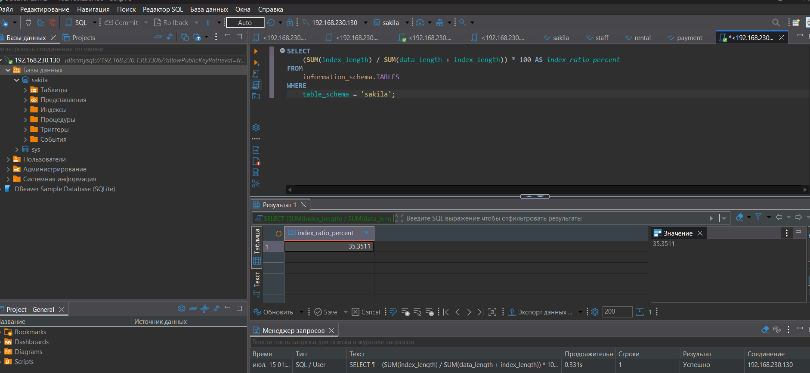
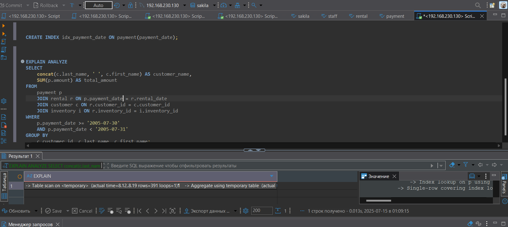

# HOMEWORK_SQL3_INDEXES


## Поднятие чистого инстанса MySQL 8.0+
```
docker run --name mysql8 -e MYSQL_ROOT_PASSWORD=123 -e MYSQL_USER=art -e MYSQL_PASSWORD=123 -p 3306:3306 -d mysql:8.0

```



-- дальше можно работать в консоли:

```
docker exec -it mysql8 mysql -u root -p
```
или 
```
docker exec -it mysql8 mysql -u root -p -e "SELECT user, host FROM mysql.user;"
```



-- а можно в бобре: 


Если плолучили ошибку при подключении 
```
debiver Public Key Retrieval is not allowed 
```
выбираем URL набираем: 
```
jdbc:mysql://192.168.230.130:3306/?allowPublicKeyRetrieval=true&useSSL=false
```


```
use sakila;

```
Задание можно выполнить как в любом IDE, так и в командной строке.
# Задание 1
Напишите запрос к учебной базе данных, который вернёт процентное отношение общего размера всех индексов к общему размеру всех таблиц.

```
SELECT 
    (SUM(index_length) / SUM(data_length + index_length)) * 100 AS index_ratio_percent
FROM 
    information_schema.TABLES
WHERE 
    table_schema = 'sakila';

```


# Задание 2
Выполните explain analyze следующего запроса:
```
select distinct concat(c.last_name, ' ', c.first_name), sum(p.amount) over (partition by c.customer_id, f.title)
from payment p, rental r, customer c, inventory i, film f
where date(p.payment_date) = '2005-07-30' and p.payment_date = r.rental_date and r.customer_id = c.customer_id and i.inventory_id = r.inventory_id
```
перечислите узкие места;
Узкие места:
- Использование DISTINCT с оконной функцией - избыточно и ресурсоемко
- Неявное соединение таблиц через запятую (устаревший синтаксис)
- Функция date(p.payment_date) препятствует использованию индексов
- Оконная функция с partition по двум столбцам, включая название фильма
- Отсутствие явного соединения для таблицы film


оптимизируйте запрос: внесите корректировки по использованию операторов, при необходимости добавьте индексы.


Оптимизированный запрос:
sql
-- Создание индекса для даты платежа (если еще нет)
```
CREATE INDEX idx_payment_date ON payment(payment_date);
```
-- Оптимизированный запрос

```
EXPLAIN ANALYZE
SELECT 
    concat(c.last_name, ' ', c.first_name) AS customer_name,
    SUM(p.amount) AS total_amount
FROM 
    payment p
    JOIN rental r ON p.payment_date = r.rental_date
    JOIN customer c ON r.customer_id = c.customer_id
    JOIN inventory i ON r.inventory_id = i.inventory_id
WHERE 
    p.payment_date >= '2005-07-30' 
    AND p.payment_date < '2005-07-31'
GROUP BY 
    c.customer_id, c.last_name, c.first_name;
    ```
Улучшения:

Замена DISTINCT + оконной функции на GROUP BY

Явные JOIN вместо неявных соединений

Условие по дате без функции, позволяющее использовать индекс

Удаление ненужного соединения с таблицей film

Более простая и эффективная агрегация


# Задание 3*
Самостоятельно изучите, какие типы индексов используются в PostgreSQL. Перечислите те индексы, которые используются в PostgreSQL, а в MySQL — нет.

Приведите ответ в свободной форме.

GIN (Generalized Inverted Index):

Оптимизирован для составных значений (массивы, JSON, полнотекстовый поиск)

Позволяет эффективно искать элементы внутри сложных структур данных

GiST (Generalized Search Tree):

Поддерживает геометрические данные и поиск по радиусу

Используется для GIS-приложений и специализированных типов данных

Может работать с нечеткими сравнениями

SP-GiST (Space-Partitioned GiST):

Оптимизирован для неоднородных данных

Эффективен для пространственного разбиения данных

BRIN (Block Range INdex):

Компактные индексы для очень больших таблиц

Работает с диапазонами блоков данных

Эффективен для данных с естественной сортировкой (например, временные ряды)

Частичные индексы (Conditional):

Хотя MySQL 8+ добавил функциональные индексы, PostgreSQL имеет более развитую поддержку

Можно создать индекс только для строк, удовлетворяющих условию

Индексы по выражениям:

Более мощная реализация, чем в MySQL

Могут включать сложные выражения и функции

Bitmap-индексы:

Автоматически используются оптимизатором в определенных сценариях

Эффективны для колонок с небольшим количеством уникальных значений

PostgreSQL также поддерживает создание пользовательских типов индексов через систему расширений, что дает большую гибкость по сравнению с MySQL.